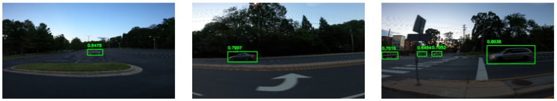

# YOLOv8 Object Detection

## Overview

This repository contains the implementation of YOLOv8 for object detection using the Car Object Detection dataset. The project is built using PyTorch and Ultralytics.



## Table of Contents

- [Installation](#installation)
- [Datasets](#datasets)
- [Dataset Splitting](#dataset-splitting)
- [Converting Dataset to YOLO Format](#converting-dataset-to-yolo-format)
- [Training the Model](#training-the-model)
- [Visualizing Predictions](#visualizing-predictions)
- [Results](#results)
- [Contributing](#contributing)
- [License](#license)

## Installation

```bash
pip install ultralytics
pip install pycocotools
pip install wandb
# Add any additional installation steps
```

## Datasets

The Car Object Detection dataset used in this project can be found on Kaggle. To download and set up the dataset, follow the steps below:

1. Mount your Google Drive.
2. Install Kaggle and set up your Kaggle API key.
3. Download and unzip the Car Object Detection dataset.

## Dataset Splitting

The dataset is split into training and validation sets using random indices.

## Converting Dataset to YOLO Format

The dataset is converted to YOLO format, and bounding box coordinates are normalized. YOLO format files and images are organized into appropriate directories.

## Training the Model

The YOLOv8 model is trained on the dataset using specified configurations. Model training details can be found in the code.

## Visualizing Predictions

Predictions are made on test images, and the results are visualized. Bounding boxes with confidence scores are drawn on the images.

## Results

Mean Average Precision (mAP) metrics are computed for the trained model on the validation set.

```bash
Mean Average Precision @.5:.95 : {metrics.box.map}
Mean Average Precision @ .50   : {metrics.box.map50}
Mean Average Precision @ .70   : {metrics.box.map75}
```

## Contributing

Feel free to contribute to this project. Follow the [Contribution Guidelines](CONTRIBUTING.md) for more details.

## License

This project is licensed under the [MIT License](LICENSE).
